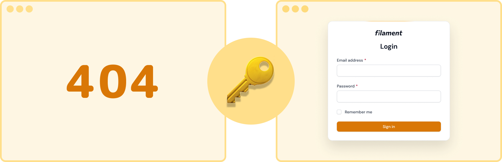

<h1 align="center">Filament Access Secret</h1>

<p align="center"></p>

<p align="center">
    <a href="https://github.com/dasundev/filament-access-secret/actions"></a>
    <a href="https://packagist.org/packages/dasundev/filament-access-secret"></a>
    <a href="https://packagist.org/packages/dasundev/filament-access-secret"></a>
    <a href="https://packagist.org/packages/dasundev/filament-access-secret"></a>
</p>

## ✨ Introduction
This package provides a middleware for securing access to Filament by requiring a secret key to be provided in the URL.

## 🔍 How it Works

Once you set up and configure this package, it works by preventing access to `http://my-website.com/admin`. If you try to visit that link, you will see a "404" message. But if you add the secret key at the end of the URL like this: `http://my-website.com/admin/secret`, you will be able to access the admin panel.

> This functionality is facilitated through a specific type of cookie working behind the scenes. This cookie validates whether you possess the authorization to access the Filament panel.

## 📦 Installation

You can install the package via Composer:

 ```bash
 composer require dasundev/filament-access-secret
 ```


If you're using Filament 2, please use this version:

 ```bash
 composer require dasundev/filament-access-secret:v1.*
 ```

Optionally, you can publish the config file using:

```bash
php artisan vendor:publish --tag="filament-access-secret-config"
```
## 👩‍💻 Usage

After installing the package, open the .env file and add the following key with your secret key:

```dotenv
DEFAULT_FILAMENT_ACCESS_SECRET_KEY=default123
```

To access Filament, append the secret key to the Filament URL like this:

```
https://my-website.com/admin/secret
```

#### For Filament 3: Updating Middleware Order

Open the `app/Providers/Filament/AdminPanelProvider.php` and right at the start of the list of middleware, add `VerifyAdminAccessSecret` middleware as follows.

```php
use Dasundev\FilamentAccessSecret\Middleware\VerifyAdminAccessSecret;

class AdminPanelProvider extends PanelProvider
{
    public function panel(Panel $panel): Panel
    {
        return $panel
            ...
            ->middleware([
                VerifyAdminAccessSecret::class,
                // Other middlewares...
            ])
            ...;
    }
}
```

Now, your Filament access is secured with the provided secret key.

## 🔥 Multiple Panel Support

The filament access secret is supports for multiple panels with different secret keys.

To enable it, you must publish the configuration file by running the following command.

```bash
php artisan vendor:publish --tag="filament-access-secret-config"
```

Then open the config file at `config/filament-access-secret.php` and add your new key with the env variable as follows.

```php
'keys' => [
    ...
    'app' => env('APP_FILAMENT_ACCESS_SECRET_KEY', ''), // "app" is the id of the panel
],
```

Now you can set a secret key for the new panel (in this case for the "app" panel).

```dotenv
APP_FILAMENT_ACCESS_SECRET_KEY=app123
```

## 🚫 Disable Secret Access

If you want to disable secret access, leave each secret environment key value blank or delete it from the .env file as follows.

```dotenv
DEFAULT_FILAMENT_ACCESS_SECRET_KEY=
APP_FILAMENT_ACCESS_SECRET_KEY=
```

## 🔐 Enhance Security
To enhance security, you have the option to include your own cookie class through the configuration file.

```php
<?php

return [
 
    /*
    |--------------------------------------------------------------------------
    | Access Secret Cookie
    |--------------------------------------------------------------------------
    |
    | To use your own access secret cookie, set it here.
    |
    */

    'cookie' => MyAccessSecretCookie::class
];

```

## 📌 Special Note
The filament access secret key only works if your panel provider ID and path are the same.

```php
class AdminPanelProvider extends PanelProvider
{
    public function panel(Panel $panel): Panel
    {
        return $panel
            ->default()
            ->id('admin')
            ->path('admin')
```

You get the idea right? 🙌

## 🔄 Changelog

Please see [CHANGELOG](CHANGELOG.md) for more information on what has changed recently.

## 🤝 Contributing

Please see [CONTRIBUTING](CONTRIBUTING.md) for details.
