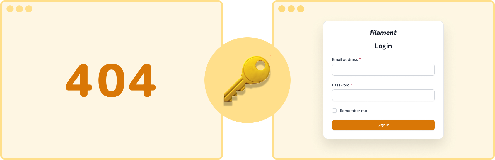

<h1 align="center">Filament Access Secret</h1>

This package provides a middleware for securing access to Filament by requiring a secret key to be provided in the URL.

## Version Compatibility

- **Filament v3 & v4** - Fully supported ✅
- **Laravel 10, 11, 12** - Fully supported ✅
- **PHP 8.1, 8.2, 8.3** - Fully supported ✅

## Documentation

You can find the documentation [here](https://dasun.dev/docs/filament-access-secret), which provides detailed information on installing and using the package.

## Changelog

Please see [CHANGELOG](CHANGELOG.md) for more information on what has changed recently.

## Contributing

Please see [CONTRIBUTING](CONTRIBUTING.md) for details.
